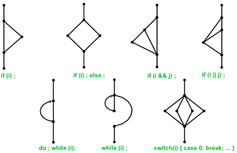

# Caja blanca

Son los métodos para diseñar casos de prueba **basándose en el código** (conjunto P).

También llamados **métodos estructurales**.

## Métodos de diseño de caja blanca
* Flujo de datos: Flujo de valores de las variables (propagación de valores)
  * Estatico (no ejec. cód.) Ver anomalías. Ej: Variables repetidas
  * Dinámico (ejec. cód.) Ejecutar caminos de una variable.
* Flujo de control (dinámico, ejec. cód.)
  1. Diseñar CFG
  2. Criterio para seleccionar caminos. (Pq no podemos hacer pruebas exhaustivas)

> Segú qué método elijas, obtedrás conjuntos DIFERENTES de casos de prueba.
> Pero el conjunto obtenido será EFECTIVO y EFICIENTE
>
> * EFECTIVO: No dejarse nada
> * EFICIENTE: No hay duplicados

## Control Flow Testing: Método del camino básico

Propuesto por Tom McCabe en 1976.
 
### 1. Construir grafo
* Análizar la lógica del programa (`if`, `for`, `try`, ...)
* Un nodo contiene códiogo sequencial (asignaciones, llamadas a funciones).
* Un nodo solo puede tener 1 condición (y la indicamos al lado).
* Si la condición tiene `&&` o `||`, se pone en varios nodos.
* El grafo solo tiene 1 nodo inicial y final.

* El bucle `for` es igual que el `while`
* Los `catch` es igual que el `||` (cambiar condiciones por excepciones)

### 2. Seleccionar caminos independientes
No queremos que quede ningún nodo por visitar,
ni ninguna arista por recorrer.
    
* Cálculo de la Complejidad Ciclomática
  * CC = número de arcos - número de nodos + 2 (la más fiable)
  * CC = número de regiones (la exterior también cuenta)
  * CC = número de condiciones + 1
  
* La `CC` indica que **como máximo** hay X formas de recorrer el grafo para que no quede ningún camino por visitar.
* Si la `CC` es muy grande (>15) significa que hay que granular: Abstraer parte de la unidad en otra unidad.

> #### Pregunta de examen
>
> 2 personas recorren recorren todo el grafo usando caminos diferntes. Uno encuentra el error y otro no. ¿Cómo?
>
> Porque aunque ambas personas pasaron por la misma línea de código, empezaron el camino por sitios distintos.
> Eso es suficiente para que se manifiete el error o no.

### 3. Obtener cjto de casos de prueba
Ahora hay que proporcinar datos concretos para cada camino del grafo.
* Si la entrada es un objeto, se particiona en varias entradas.
