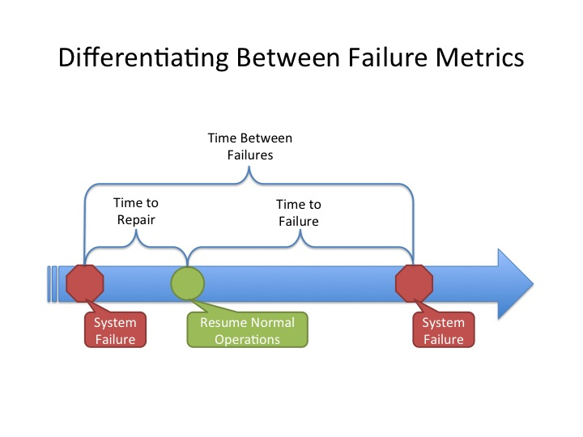

# Pruebas de aceptación 3

## Propiedades emergentes no funcionales
**Como de bien** hago las cosas, (*"-ilidades"*). En general, determinan el RENDIMIENTO de nuestra aplicación.

* **Fiabilidad**: Probabilidad de funcionamiento sin fallos durante un tiempo determinado en un entorno específico.
* **Disponibilidad**: Tiempo durante el cual el sistema proporciona servicio al usuario. Suele expresarse como: hh/dd (p.ej 24/7: 24 horas al día, 7 días por semana)
* **Mantenibilidad**: Capacidad de un sistema para soportar cambios. Hay tres tipos de cambios:
  * **Correctivos**: Son provocados por errores detectados en la aplicación
  * **Adaptativos**: Son provocados por cambios en el hardware y/o software (sistema operativo) sobre los que se ejecuta nuestra aplicación
  * **Perfectivos**: Debidos a que se quiere añadir/modificar las funcionalidades existentes para ampliar/mejorar el "negocio" que sustenta nuestra aplicación
* **Escalabilidad**: Hace referencia a la capacidad de mantener el tiempo de respuesta ante cambios en el número de usuarios que utilizan el sistema.

Estas propiedades emergentes (de los criterios de acepación) deben ser **cuantificables**.

* ~*"Las peticiones se tienen que servir en un tiempo razonable"*~ **Mal**
* *"Las peticiones se tienen que servir en menos de 5 segundos"* **Bien**

## Métricas

* **MTTF**: Mean Time To Failure (uptime)
* **MTTR**: Mean Time To Repair (downtime)
* **MTBF**=MTTF+MTTR: Mean time between failures

* **Fiabilidad**: Se utilizan las métricas MTTF, MTTR, y MTBF.
* **Disponibilidad**: Se utiliza la métrica MTTR para medir el "downtime".
* **Mantenibilidad**: Se utiliza la métrica MTTR que refleja el tiempo arreglar defecto correctivo.
* **Escalabilidad**: Utiliza el número de transacciones (operaciones) por unidad de tiempo.

## Ejemplos de pruebas

* **Pruebas de carga**: Validan el rendimiento. *"Una petición se debe tratar en menos de 2s cuando existen 10000 usuarios"*
* **Pruebas de stress**: "Forzar" peticiones al sistema por encima del límite del diseño del software. Fiabilidad y robustez.
* **Pruebas estadísticas**: Evaluan la fidelidad.
  1. Construir un "perfil operacional" que refleje el uso real del sistema.
  2. Generar un conjunto de datos de prueba que reflejen dicho perfil operacional.
  3. Probar dichos datos midiendo el número de fallos y el tiempo entre fallos. Calculando así (estadisticamente) la fiabilidad.

> El perfil operacional es la base para el diseño de pruebas emergentes no funcionales

#### Paso 1:

**Perfil operacional**. (Refleja el uso real del sistema).

| Clase de entrada | Prob. de ocurrencia | Intervalo |
|------------------|---------------------|-----------|
| C1               | 50%                 | 1-49      |
| C2               | 15%                 | 50-63     |
| C3               | 15%                 | 64-78     |
| C4               | 15%                 | 79-94     |
| C5               | 5%                  | 95-99     |

#### Paso 2:

**Cjto de datos de prueba** que reflejen el perfil operacional. (Se generan números aleatorios entre 1 y 99).

`13-94-22-24-45-56-81-19-31-69-45-9-38-21-52-84-86-97-...`

Y se derivan casos de prueba:

`C1-C4-C1-C1-C1-C2-C4-C1-C1-C1-C3-C1-C1-C1-C1-C2-C4-C4-C5-...`

#### Paso 3:

Probar dichos datos (ejecutar las pruebas) midiendo el **número de fallos** y el **tiempo entre fallos**, calculando así la fiabilidad (MTTF, MTTR, y MTBF).

## JMeter

Apache JMeter es una herramienta diseñada para medir el rendimiento **mediante pruebas de carga**.

* Permite múltiples hilos de ejecución concurrente.
* JMeter permite trabajar con muchos tipos distintos de aplicaciones.
