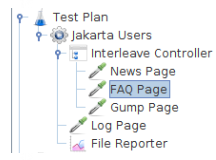
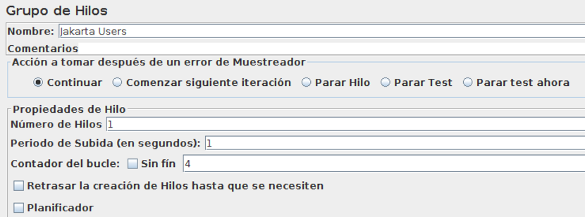

# Pruebas de aceptación 3

## Propiedades emergentes no funcionales
**Como de bien** hago las cosas, (*"-ilidades"*). En general, determinan el RENDIMIENTO de nuestra aplicación.

* **Fiabilidad**: Probabilidad de funcionamiento sin fallos durante un tiempo determinado en un entorno específico.
* **Disponibilidad**: Tiempo durante el cual el sistema proporciona servicio al usuario. Suele expresarse como: hh/dd (p.ej 24/7: 24 horas al día, 7 días por semana)
* **Mantenibilidad**: Capacidad de un sistema para soportar cambios. Hay tres tipos de cambios:
  * **Correctivos**: Son provocados por errores detectados en la aplicación
  * **Adaptativos**: Son provocados por cambios en el hardware y/o software (sistema operativo) sobre los que se ejecuta nuestra aplicación
  * **Perfectivos**: Debidos a que se quiere añadir/modificar las funcionalidades existentes para ampliar/mejorar el "negocio" que sustenta nuestra aplicación
* **Escalabilidad**: Hace referencia a la capacidad de mantener el tiempo de respuesta ante cambios en el número de usuarios que utilizan el sistema.

Estas propiedades emergentes (de los criterios de acepación) deben ser **cuantificables**.

* ~*"Las peticiones se tienen que servir en un tiempo razonable"*~ **Mal**
* *"Las peticiones se tienen que servir en menos de 5 segundos"* **Bien**

## Métricas

* **MTTF**: Mean Time To Failure (uptime)
* **MTTR**: Mean Time To Repair (downtime)
* **MTBF**=MTTF+MTTR: Mean time between failures


* **Fiabilidad**: Se utilizan las métricas MTTF, MTTR, y MTBF.
* **Disponibilidad**: Se utiliza la métrica MTTR para medir el "downtime".
* **Mantenibilidad**: Se utiliza la métrica MTTR que refleja el tiempo arreglar defecto correctivo.
* **Escalabilidad**: Utiliza el número de transacciones (operaciones) por unidad de tiempo.

## Ejemplos de pruebas

* **Pruebas de carga**: Validan el rendimiento. *"Una petición se debe tratar en menos de 2s cuando existen 10000 usuarios"*
* **Pruebas de stress**: "Forzar" peticiones al sistema por encima del límite del diseño del software. Fiabilidad y robustez.
* **Pruebas estadísticas**: Evaluan la fidelidad.
  1. Construir un "perfil operacional" que refleje el uso real del sistema.
  2. Generar un conjunto de datos de prueba que reflejen dicho perfil operacional.
  3. Probar dichos datos midiendo el número de fallos y el tiempo entre fallos. Calculando así (estadisticamente) la fiabilidad.

> El perfil operacional es la base para el diseño de pruebas emergentes no funcionales

#### Paso 1:

**Perfil operacional**. (Refleja el uso real del sistema).

| Clase de entrada | Prob. de ocurrencia | Intervalo |
|------------------|---------------------|-----------|
| C1               | 50%                 | 1-49      |
| C2               | 15%                 | 50-63     |
| C3               | 15%                 | 64-78     |
| C4               | 15%                 | 79-94     |
| C5               | 5%                  | 95-99     |

#### Paso 2:

**Cjto de datos de prueba** que reflejen el perfil operacional. (Se generan números aleatorios entre 1 y 99).

`13-94-22-24-45-56-81-19-31-69-45-9-38-21-52-84-86-97-...`

Y se derivan casos de prueba:

`C1-C4-C1-C1-C1-C2-C4-C1-C1-C1-C3-C1-C1-C1-C1-C2-C4-C4-C5-...`

#### Paso 3:

Probar dichos datos (ejecutar las pruebas) midiendo el **número de fallos** y el **tiempo entre fallos**, calculando así la fiabilidad (MTTF, MTTR, y MTBF).


## JMeter

Apache JMeter es una herramienta diseñada para medir el rendimiento **mediante pruebas de carga**.
(Permite trabajar con muchos tipos de aplicaciones).

```
$ jmeter
```

Un **plan de pruebas** JMeter está formado por por:
* Uno o más **grupos de hilos** (Thread Groups) que a su vez tiene:
  * Samplers (muestreadores) envían peticiones a un servidor. : Trabajan conjuntamente con un sampler.
  * Controladores lógicos (Logic Controllers): Actúan sobre sus elementos hijo
    * Simple controller: Simplemente agrupa.
    * Loop controller: Itera un número de veces.
    * Only once controller: Sólo se procesa una vez en el plan de pruebas.
    * Interleave controller: Ejecuta un solo hijo en cada iteración, hasta que se ejcutan todos de forma secuencial.
  * Temporizador (Timer): Permiten introducir pausas antes de cada una de las peticiones de cada hilo.
  * Aserciones de respuesta: Permiten hacer afirmaciones sobre las respuestas recibidas del sampler.
  * Listeners: Almacenar en el disco los resultados de las peticiones realizadas.
  * Pre-Processors y Post-Processors

> En el grupo de hilos se especifica:
> * Cuántos hilos (usurarios) actuarán en paralelo.
> * Y el periodo de subida (RAMP-UP) es tiempo que tarda en crearse los hilos (50 hilos y 100s -> un hilo cada 2s).

Y Se ejecutan en este orden:

1. Configuration elements
2. Pre-Processors
3. Timers
4. Sampler
5. Post-Processors (unless SampleResult is null)
6. AsserRons (unless SampleResult is null)
7. Listeners (unless SampleResult is null)

### Servidor proxy

> #### Servidor proxy
> Intermediario (B) en las peticiones de recursos que realiza un cliente (A) a un servidor (C).

JMeter tendría dificultad cuando hay formularios complejos, peticiones http POST, peticiones javascript,... porque los parámetros NO son visibles en la URL.

Por eso, JMeter proporciona un servidor HTTP proxy, a través del cual podemos utilizar el navegador para realizar las pruebas, y JMeter "grabará" las peticiones http generadas, (creando los correspondientes HTTP samplers).

Es un elemento del **banco de trabajo** (no del plan de test) que se selecciona con `Añadir → ElementosNoDePrueba → Servidor Proxy HTTP`. Y le asignamos un puerto que esté libre como por ejemplo `8888`.

Dado que JMeter "grabará" todas las acciones que realicemos en el navegador en un controlador de tipo "recording", tendremos que incluir un controlador de este tipo en nuestro plan de pruebas. Lo primero que haremos será añadir un grupo de hilos en nuestro plan. Desde el menú contextual del nodo "Plan de Pruebas", elegiremos `Añadir→Hilos→Grupo de hilos`. A continuación, desde el menú contextual del grupo de hilos que acabamos de añadir tendremos que elegir `Añadir→Controlador lógico→Controlador Grabación`.


# Ejercicios

#### Contesta a las siguientes cuestiones sobre el servidor proxy http en JMeter:

##### a) ¿Para qué se utiliza?

Para hacer de intermediario entre las peticiones HTTP que "grabamos" y enviarselas al servidor. De esta forma JMeter puede ver parametros ocultos de algunas peticiones como POSTs, formularios, etc.

##### b) Cita un caso concreto de su uso en la práctica del laboratorio.

##### c) Indica los pasos a seguir para utilizarlo (sin incluir parámetros concretos de configuración)

Es un elemento del **banco de trabajo** (no del plan de test) que se selecciona con `Añadir → ElementosNoDePrueba → Servidor Proxy HTTP`. Y le asignamos un puerto que esté libre como por ejemplo `8888`.

Por defecto, el servidor proxy interceptará todas las peticiones http dirigidas a nuestra aplicación y las "grabará" en un controlador de tipo recording (ver el valor del campo Contenido del plan de pruebas→Controlador objetivo, de la conSiguración del Servidor Proxy HTTP).

Dado que JMeter "grabará" todas las acciones que realicemos en el navegador en un controlador de tipo "recording", tendremos que incluir un controlador de este tipo en nuestro plan de pruebas.

#### Dado el siguiente plan JMeter y la configuración del grupo de hilos, indica la secuencia ordenada de las peticiones http que se ejecutan:




